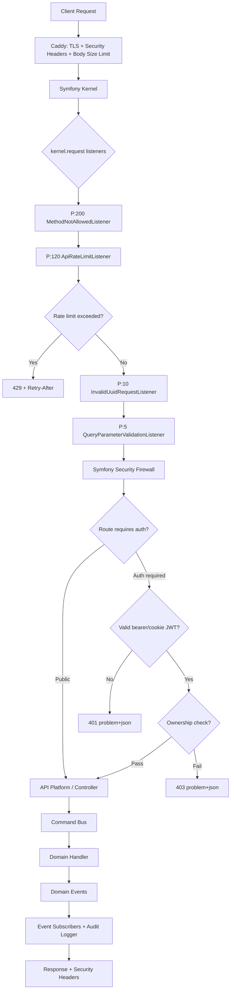

# Architecture Decision Document — Auth Sign-in + 2FA

_This document builds collaboratively through step-by-step discovery. Sections are appended as we work through each architectural decision together._

**Revision:** 5 — TEA Party Mode R3 Multi-Model Adversarial Review (addresses R1 13 + R2 4 + R3 3 critical gaps)

## Context and Constraints

This design extends the VilnaCRM User Service with sign-in, 2FA (including recovery codes), session cookies, refresh token rotation, logout, and full security hardening. The architecture remains hexagonal: operations and DTOs in Application, pure entities in Domain, persistence in Infrastructure.

**Existing stack:** PHP 8.3, Symfony 7.2, API Platform 4.1, MongoDB (Doctrine ODM), Redis, League OAuth2 Server, Caddy/FrankenPHP.

**Critical finding:** The current Symfony firewall is disabled (`security: false`). This architecture explicitly addresses that gap.

**Additional findings (TEA Party Mode R1):**
- Bcrypt cost is 4 (must be >= 12)
- Confirmation token length is 10 characters (must be >= 32)
- Password grant bypasses 2FA (must be disabled)
- GraphQL mutations lack ownership enforcement
- No logout mechanism exists
- No 2FA disable or recovery flow exists
- Several endpoints missing from rate limiting and access control
- No audit logging for auth events

**Additional findings (TEA Party Mode R2 — OWASP 2025 cross-reference):**
- JWT access token remains valid after session revocation (1h window → reduced to 15 min)
- JWT claims structure not specified (missing iss, aud, nbf, jti, sid)
- 2FA enablement doesn't invalidate existing sessions (stolen session persists)
- No constant-time credential validation (timing-based email enumeration)
- Cookie missing `__Host-` prefix (subdomain attack vector)
- No account lockout after cumulative failures (rate limiting resets per window)
- No `WWW-Authenticate` header on 401 responses (RFC 7235)

**Constraints:**

- Domain layer must remain framework-free (Deptrac enforced).
- All command/event patterns use existing CQRS bus infrastructure.
- API Platform resource configuration via YAML (no PHP attributes on entities).
- Quality thresholds: PHPInsights 94/100/100/100, Deptrac 0, Psalm 0.

## ADR-01: Authentication Strategy — Dual Bearer + Cookie (JWT)

**Decision:** Support both OAuth2 bearer tokens (JWT) and HttpOnly session cookies as first-class authentication methods. The session cookie contains a signed JWT (same format as the bearer token), not a PHP session ID.

**Context:** Web clients need cookie-based auth for CSRF-resistant browser sessions. Mobile and third-party clients need stateless JWT auth. Both must be validated by the same auth gate.

**Options considered:**

| Option | Pros | Cons |
|--------|------|------|
| A. Bearer only | Simple, stateless | No cookie support for web; XSS risk if tokens stored in localStorage |
| B. Cookie only | Secure for web | Mobile/API clients need bearer tokens |
| **C. Dual (chosen)** | Both client types supported | Slightly more complex auth gate |

**Implementation:** Symfony security firewall with a custom authenticator that checks `Authorization: Bearer <token>` header first, then falls back to extracting the JWT from the session cookie. Both resolve to the same `User` entity. The firewall remains `stateless: true` because both methods use self-contained JWTs — no server-side PHP sessions are needed.

**JWT claims structure:**

| Claim | Type | Value | Purpose |
|-------|------|-------|---------|
| `sub` | string | User ULID | Subject (RFC 7519) |
| `iss` | string | `vilnacrm-user-service` | Issuer — prevents token confusion between services |
| `aud` | string | `vilnacrm-api` | Audience — rejects tokens intended for other services |
| `exp` | int | Issue time + 15 min | Expiration (reduced from 1h to limit revocation window) |
| `iat` | int | Current timestamp | Issued-at |
| `nbf` | int | Current timestamp | Not-before — prevents premature token usage |
| `jti` | string | Random UUID | JWT ID — enables future jti denylist for immediate revocation (Growth) |
| `sid` | string | AuthSession ULID | Session ID — required for logout/session identification |
| `roles` | string[] | `["ROLE_USER"]` or `["ROLE_SERVICE"]` | Symfony Security roles |

**Validation rules:** DualAuthenticator MUST verify: `iss` is a single string (not array) matching `vilnacrm-user-service`, `aud` matches `vilnacrm-api`, `nbf <= now`, `exp > now`, algorithm is RS256. Reject any token failing these checks.

**Token revocation strategy (MVP):** Access token TTL is 15 minutes. Session revocation (logout, password change, 2FA enable) immediately revokes refresh tokens, preventing new JWTs. Existing JWTs remain valid for up to 15 minutes — this is an accepted tradeoff. **Growth:** Add `jti` denylist in Redis for immediate revocation.

**Cookie specification:**

| Attribute | Value | Notes |
|-----------|-------|-------|
| Name | `__Host-auth_token` | `__Host-` prefix enforces: Secure, no Domain attr, prevents subdomain attacks |
| Value | Signed JWT (same as bearer token) | Self-contained; works with stateless firewall |
| HttpOnly | true | Prevents JS access (XSS mitigation) |
| Secure | true | HTTPS only (enforced by `__Host-` prefix) |
| SameSite | Lax | Allows top-level navigation from external links |
| Path | `/api` | Scoped to API routes only |
| Max-Age | 900 (15 min) or 2592000 (30 days) | Based on `remember_me` flag; short session matches JWT TTL |

**CORS requirement:** When cookie-based auth is used, CORS must be configured with `Access-Control-Allow-Credentials: true` and an explicit origin (not wildcard `*`). This is already correct in production config but must be enforced in development too.

**Trade-offs:** Small added complexity in the authenticator. Mitigated by keeping the logic in a single `DualAuthenticator` class in Infrastructure layer.

## ADR-02: Rate Limiting Strategy — Multi-Tier Sliding Window + Token Bucket

**Decision:** Implement a multi-tier rate limiting strategy using Symfony's RateLimiter component with different policies per endpoint sensitivity.

**Context:** The current service has rate limiting only on password reset. Sign-in, registration, token exchange, and all other endpoints are unprotected against abuse.

**Options considered:**

| Option | Pros | Cons |
|--------|------|------|
| A. Single global limit | Simple | Doesn't protect sensitive endpoints adequately |
| B. WAF/API Gateway only | No code changes | Doesn't integrate with app-level identity; vendor lock-in |
| **C. Multi-tier app-level (chosen)** | Granular; uses existing Redis + Symfony RateLimiter | Requires a kernel listener and multiple limiter configs |

**Rate limit tiers (complete — all endpoints):**

| Tier | Endpoint | Policy | Limit | Key |
|------|----------|--------|-------|-----|
| Global (anonymous) | All `/api/` | Sliding window | 100/min | Client IP |
| Global (authenticated) | All `/api/` | Sliding window | 300/min | Client IP |
| Sign-in | `POST /api/signin` | Sliding window | 10/min per IP, 5/min per email | IP + email |
| 2FA verification | `POST /api/signin/2fa` | Sliding window | 5/min | Pending session ID |
| Registration | `POST /api/users` | Token bucket | 5/min | Client IP |
| Token exchange | `POST /token` | Sliding window | 10/min | client_id |
| Resend confirmation | `POST /api/users/{id}/resend-...` | Token bucket | 3/min per IP + 3/min per target | Client IP + target user ID |
| Password reset | `POST /api/reset-password` | Token bucket | 1000/hr | Email (existing) |
| Email confirmation | `PATCH /api/users/confirm` | Sliding window | 10/min | Client IP |
| User collection | `GET /api/users` | Sliding window | 30/min | Client IP |
| 2FA setup | `POST /api/users/2fa/setup` | Sliding window | 5/min | User ID |
| 2FA confirm | `POST /api/users/2fa/confirm` | Sliding window | 5/min | User ID |
| 2FA disable | `POST /api/users/2fa/disable` | Sliding window | 3/min | User ID |
| User update | `PATCH/PUT /api/users/{id}` | Sliding window | 10/min | User ID |
| User delete | `DELETE /api/users/{id}` | Sliding window | 3/min | User ID |
| Recovery codes | `POST /api/users/2fa/recovery-codes` | Sliding window | 3/min | User ID |

**Implementation:** A single `ApiRateLimitListener` registered at `kernel.request` priority 120 (before auth gate). Placed in `Shared/Application/EventListener/` alongside existing listeners. Resolves the appropriate limiter factory based on route + method. All limits configurable via env vars.

**Trade-off:** Token bucket allows short bursts (good for UX on registration), sliding window provides smoother throttling (better for sign-in abuse prevention).

## ADR-03: Auth Gate — Symfony Firewall + Access Control

**Decision:** Enable the Symfony security firewall with OAuth2 authenticator and use `access_control` rules for route-level authorization. Add API Platform `security` expressions for resource-level ownership enforcement on both REST and GraphQL operations.

**Context:** The firewall is currently disabled. We need blanket authentication enforcement with an explicit public allowlist.

**Firewall configuration:**

```yaml
firewalls:
  oauth:
    pattern: ^/(token|authorize|\.well-known)
    security: false  # OAuth endpoints handle their own auth

  api:
    pattern: ^/
    security: true
    stateless: true
    oauth2: true  # League OAuth2 Server authenticator
```

**Access control rules (order matters):**

```yaml
access_control:
  # Public endpoints — VERIFIED against actual routes (bin/console debug:router)
  - { path: ^/api/users$, methods: [POST], roles: PUBLIC_ACCESS }
  - { path: ^/api/users/confirm$, methods: [PATCH], roles: PUBLIC_ACCESS }
  - { path: ^/api/reset-password, roles: PUBLIC_ACCESS }
  - { path: ^/api/signin, roles: PUBLIC_ACCESS }
  - { path: ^/api/token$, methods: [POST], roles: PUBLIC_ACCESS }
  - { path: ^/api/docs, roles: PUBLIC_ACCESS }
  - { path: ^/api/health, roles: PUBLIC_ACCESS }
  - { path: ^/healthz, roles: PUBLIC_ACCESS }

  # Service-level
  - { path: ^/api/users/batch$, methods: [POST], roles: ROLE_SERVICE }

  # Authenticated (catch-all)
  - { path: ^/api/, roles: ROLE_USER }
  - { path: ^/graphql, roles: ROLE_USER }
  - { path: ^/authorize, roles: IS_AUTHENTICATED_REMEMBERED }
```

**Key corrections from TEA review:**
1. Password reset route corrected from `^/api/users/password-reset` to `^/api/reset-password` (matching actual `EmptyResponse.yaml` resource routes)
2. Health check route corrected to include both `/api/health` (API Platform) and `/healthz` (if Caddy-level)
3. All routes verified against `bin/console debug:router` output

**Ownership enforcement — REST (API Platform YAML):**

```yaml
ApiPlatform\Metadata\Patch:
  security: "is_granted('ROLE_USER') and object.getId().toRfc4122() == user.getId().toRfc4122()"
ApiPlatform\Metadata\Put:
  security: "is_granted('ROLE_USER') and object.getId().toRfc4122() == user.getId().toRfc4122()"
ApiPlatform\Metadata\Delete:
  security: "is_granted('ROLE_USER') and object.getId().toRfc4122() == user.getId().toRfc4122()"
```

**Ownership enforcement — GraphQL mutations:**

```yaml
# In User.yaml graphql section
updateUser:
  security: "is_granted('ROLE_USER') and object.getId().toRfc4122() == user.getId().toRfc4122()"
deleteUser:
  security: "is_granted('ROLE_USER') and object.getId().toRfc4122() == user.getId().toRfc4122()"
resendEmailTo:
  security: "is_granted('ROLE_USER') and object.getId().toRfc4122() == user.getId().toRfc4122()"
```

**Complete endpoint map:**

| Route | Method | Auth Required | Rate Limit Tier |
|-------|--------|---------------|-----------------|
| `/api/users` | GET | ROLE_USER | 30/min per IP |
| `/api/users/{id}` | GET | ROLE_USER | Global |
| `/api/users` | POST | PUBLIC_ACCESS | 5/min per IP (registration) |
| `/api/users/batch` | POST | ROLE_SERVICE | Global |
| `/api/users/{id}` | PATCH | ROLE_USER + ownership | 10/min per user |
| `/api/users/{id}` | PUT | ROLE_USER + ownership | 10/min per user |
| `/api/users/{id}` | DELETE | ROLE_USER + ownership | 3/min per user |
| `/api/users/confirm` | PATCH | PUBLIC_ACCESS | 10/min per IP |
| `/api/users/{id}/resend-confirmation-email` | POST | ROLE_USER + ownership | 3/min per IP + 3/min per target |
| `/api/reset-password` | POST | PUBLIC_ACCESS | 1000/hr per email |
| `/api/reset-password/confirm` | POST | PUBLIC_ACCESS | 10/min per IP |
| `/api/signin` | POST | PUBLIC_ACCESS | 10/min IP + 5/min email |
| `/api/signin/2fa` | POST | PUBLIC_ACCESS | 5/min per session |
| `/api/token` | POST | PUBLIC_ACCESS | 10/min per client_id |
| `/api/signout` | POST | ROLE_USER | 10/min per user |
| `/api/signout/all` | POST | ROLE_USER | 5/min per user |
| `/api/users/2fa/setup` | POST | ROLE_USER | 5/min per user |
| `/api/users/2fa/confirm` | POST | ROLE_USER | 5/min per user |
| `/api/users/2fa/disable` | POST | ROLE_USER | 3/min per user |
| `/api/users/2fa/recovery-codes` | POST | ROLE_USER | 3/min per user |
| `/api/health` | GET | PUBLIC_ACCESS | Global |
| `/api/docs` | GET | PUBLIC_ACCESS | Global |
| `/token` | POST | Own auth (OAuth) | 10/min per client_id |
| `/authorize` | GET | IS_AUTHENTICATED | Global |
| `/.well-known/*` | GET | security: false | Global |
| `/graphql` | POST | ROLE_USER + per-mutation ownership | Global + depth/complexity |

## ADR-04: Security Headers — Caddy + Request Body Size Limit

**Decision:** Add security headers at the Caddy reverse proxy level for all responses. Add a request body size limit at the proxy level.

**Headers:**

| Header | Value | Layer |
|--------|-------|-------|
| `Strict-Transport-Security` | `max-age=31536000; includeSubDomains` | Caddy (prod only) |
| `X-Content-Type-Options` | `nosniff` | Caddy |
| `X-Frame-Options` | `DENY` | Caddy |
| `Referrer-Policy` | `strict-origin-when-cross-origin` | Caddy |
| `Content-Security-Policy` | `default-src 'none'; frame-ancestors 'none'` | Caddy |
| `-Server` | (removed) | Caddy |

**Caddy block (production):**

```
header {
    Strict-Transport-Security "max-age=31536000; includeSubDomains; preload"
    X-Content-Type-Options "nosniff"
    X-Frame-Options "DENY"
    Referrer-Policy "strict-origin-when-cross-origin"
    Content-Security-Policy "default-src 'none'; frame-ancestors 'none'"
    -Server
}
```

**Request body size limit:**

```
request_body {
    max_size 64KB
}
```

## ADR-05: Refresh Token Rotation with Grace Window

**Decision:** Each refresh rotates the token. The old token gets a grace period (default 60s, env-configurable). A rotated token can be reused exactly once within the grace window. A second reuse (or any reuse after grace) revokes the entire session.

**Storage:** Refresh tokens stored as SHA-256 hashes in MongoDB. Grace window tracked as `rotatedAt` timestamp and `graceUsed` boolean on the old token record.

**Concurrency:** Token rotation MUST use atomic MongoDB operations (`findOneAndUpdate` with `rotatedAt: null` as precondition) to prevent race conditions when two simultaneous refresh requests arrive with the same token. If the precondition fails, treat as grace window reuse.

**Logic (corrected per TEA review):**

```
on refresh(token):
  record = find_by_hash(sha256(token))
  if not record: return 401
  if record.is_revoked: return 401
  if record.is_expired: return 401
  if record.rotatedAt:
    if record.graceUsed:
      revoke_session(record.session)  # second reuse = theft
      log_alert("refresh_token_theft_detected", record.session)
      return 401
    if now() - record.rotatedAt < grace_window:
      record.graceUsed = true
      save(record)
      return issue_new_tokens(record.session)  # single grace reuse
    else:
      revoke_session(record.session)  # past grace = theft
      log_alert("refresh_token_theft_detected", record.session)
      return 401
  new_token = generate_refresh_token()
  record.rotatedAt = now()
  save(new_record_with_hash(new_token))
  return { access_token: sign_jwt(user), refresh_token: new_token }
```

## ADR-06: GraphQL Hardening — Introspection, Depth, Complexity

**Decision:** Disable GraphQL introspection in production. Enforce query depth and complexity limits in all environments.

**Implementation:**

```yaml
# config/packages/api_platform.yaml (base)
api_platform:
  graphql:
    graphiql: false
    max_query_depth: 20
    max_query_complexity: 500

# config/packages/api_platform.yaml (when@prod)
when@prod:
  api_platform:
    graphql:
      introspection: false
```

**GraphQL batching defense (TEA R3):**

OWASP API2:2023 documents that GraphQL batching bypasses per-request rate limiting. A single HTTP POST containing an array of 1,000 mutations counts as 1 request for the rate limiter.

**Required defense — implement both:**
1. Add `GraphQLBatchRejectListener` at `kernel.request` priority 130 (before rate limiter): if request path is `/graphql` and body is a JSON array (batch), reject with 400.
2. In all auth-related API Platform resource configs, set `graphql: false` to prevent auto-exposure of sign-in, 2FA, token refresh, and sign-out operations via GraphQL mutations.

**Auth operations excluded from GraphQL (explicit):** SignIn, CompleteTwoFactor, RefreshToken, SignOut, SignOutAll, SetupTwoFactor, ConfirmTwoFactor, DisableTwoFactor, RegenerateRecoveryCodes.

## ADR-12: JWT Key Security

**Decision:** JWT private key files must have restrictive permissions. Private key must not be accessible to non-owner processes.

**Context (TEA R3 finding):** The current codebase has JWT key files at `config/jwt/private.pem` with 666 permissions (world-readable/writable). A compromised dependency or path traversal vulnerability could expose the signing key, allowing JWT forgery for any user/role.

**Implementation:**
- `config/jwt/private.pem`: permissions 600 (owner read/write only)
- `config/jwt/public.pem`: permissions 644 (owner write, all read)
- Dockerfile: `RUN chmod 600 /app/config/jwt/private.pem`
- Pre-commit hook or CI check: verify private key permissions are not world-readable

**Growth:** Migrate private key from file to environment variable or Docker/Kubernetes secret.

## ADR-13: Bearer Token Sidejack Risk (Accepted for MVP)

**Decision:** Accept that bearer tokens (used by mobile/API clients) have no client binding. Document as a known risk. Token fingerprinting deferred to Growth.

**Context (TEA R3 finding):** The OWASP JWT Cheat Sheet recommends token fingerprinting (pairing JWT with a hardened cookie containing a random fingerprint, with SHA-256 hash in JWT claims). However, this only works for browser clients that support cookies — pure API clients cannot participate in fingerprinting.

**MVP mitigation:** 15-minute access token TTL limits the theft window. Refresh token rotation detects concurrent usage (theft).

**Growth implementation:**
- On sign-in/refresh: generate random fingerprint, set as `__Secure-Fgp` cookie, embed `SHA-256(fingerprint)` as `fgp` claim in JWT
- DualAuthenticator: if JWT contains `fgp` claim, verify `__Secure-Fgp` cookie matches
- Trade-off: Only binds tokens for browser clients; API clients still use unbound bearer tokens

## ADR-07: Password Grant Deprecation

**Decision:** Disable the OAuth2 password grant type after the sign-in endpoint is implemented.

**Context:** The new `POST /api/signin` endpoint replaces the password grant with a more secure flow that supports 2FA, session cookies, and audit logging. If the password grant remains active, attackers can bypass 2FA by using `POST /token` with `grant_type=password` directly.

**Implementation:**

```yaml
# config/packages/league_oauth2_server.yaml
league_oauth2_server:
  authorization_server:
    enable_password_grant: false  # was: true
```

**Migration:** Existing clients using the password grant must migrate to `POST /api/signin`. This change ships in the same release as the sign-in endpoint.

## ADR-08: Audit Logging for Authentication Events

**Decision:** All authentication-related events emit structured JSON log entries via domain event subscribers. Theft detection events emit at CRITICAL log level.

**Events logged:**

| Event | Log Level | Fields |
|-------|-----------|--------|
| `UserSignedIn` | INFO | userId, ip, userAgent, twoFactorUsed |
| `SignInFailed` | WARNING | attemptedEmail, ip, userAgent, reason |
| `TwoFactorCompleted` | INFO | userId, ip, method (totp/recovery) |
| `TwoFactorFailed` | WARNING | pendingSessionId, ip, reason |
| `TwoFactorEnabled` | INFO | userId |
| `TwoFactorDisabled` | INFO | userId |
| `SessionRevoked` | INFO | sessionId, userId, reason (logout/password-change/theft) |
| `AllSessionsRevoked` | INFO | userId, reason |
| `RefreshTokenRotated` | DEBUG | sessionId |
| `RefreshTokenTheftDetected` | CRITICAL | sessionId, userId, ip |
| `RecoveryCodeUsed` | WARNING | userId, remainingCodes |

**Implementation:** Domain events are already part of the CQRS pattern. New event classes extend `DomainEvent`. Event subscribers (auto-tagged via `_instanceof`) write to the Symfony logger with structured context arrays. No new infrastructure needed — leverages existing `monolog` configuration.

## ADR-09: Password Hashing Upgrade

**Decision:** Upgrade bcrypt cost from 4 to 12. Use Symfony's `migrate_from` for transparent re-hashing.

**Implementation:**

```yaml
# config/packages/security.yaml
password_hashers:
  App\User\Domain\Entity\User:
    algorithm: auto
    cost: 12
    migrate_from:
      - { algorithm: auto, cost: 4 }
```

Existing passwords hashed at cost 4 will be re-hashed at cost 12 on next successful login. No mass migration needed.

## ADR-10: Account Lockout After Cumulative Failures

**Decision:** Temporarily lock accounts after 20 failed sign-in attempts within 1 hour. Lockout duration: 15 minutes.

**Context:** Rate limiting (5/min per email) resets each sliding window. A persistent attacker can sustain 5 attempts/minute indefinitely = 7,200 attempts/day. Account lockout adds cumulative protection.

**Implementation:**
- Redis counter per email: key `signin_lockout:{email}`, TTL 1 hour
- Increment on each failed sign-in
- At 20: reject with 423 Locked + `Retry-After: 900` for 15 minutes
- Emit `AccountLockedOut` domain event (audit logging)
- Counter resets after 1 hour or after successful sign-in

**Trade-off:** Attackers can intentionally lock victim accounts (DoS). Mitigated by: short lockout (15 min), rate limiting still primary defense, legitimate users rarely hit 20 failures.

## ADR-11: 2FA Secret Encryption Specification

**Decision:** Encrypt TOTP secrets with AES-256-GCM before MongoDB persistence. Key from environment variable.

**Implementation:**

```yaml
# .env
TWO_FACTOR_ENCRYPTION_KEY=base64:... # 256-bit key, base64-encoded
```

- Algorithm: AES-256-GCM (authenticated encryption — integrity + confidentiality)
- IV: Random 12 bytes per encryption, stored alongside ciphertext
- Storage format: `base64(iv + ciphertext + tag)`
- Key rotation (Growth): Add `TWO_FACTOR_ENCRYPTION_KEY_PREVIOUS` env var, try current key first, fall back to previous, re-encrypt on successful decryption

## Data Model

### New Entities (Domain Layer)

**AuthSession** (`User/Domain/Entity/AuthSession`):

| Field | Type | Notes |
|-------|------|-------|
| id | ULID | Primary key |
| userId | ULID | FK to User |
| ipAddress | string | Client IP at session creation (audit trail) |
| userAgent | string | Client user-agent at session creation (audit trail) |
| createdAt | DateTimeImmutable | Session creation |
| expiresAt | DateTimeImmutable | Absolute expiry |
| revokedAt | DateTimeImmutable (nullable) | If session revoked |
| rememberMe | bool | Long vs short TTL |

**AuthRefreshToken** (`User/Domain/Entity/AuthRefreshToken`):

| Field | Type | Notes |
|-------|------|-------|
| id | ULID | Primary key |
| sessionId | ULID | FK to AuthSession |
| tokenHash | string | SHA-256 of plaintext token |
| rotatedAt | DateTimeImmutable (nullable) | When this token was rotated |
| graceUsed | bool | Whether grace reuse has been consumed (default false) |
| revokedAt | DateTimeImmutable (nullable) | Explicit revocation |
| expiresAt | DateTimeImmutable | Absolute expiry |

**PendingTwoFactor** (`User/Domain/Entity/PendingTwoFactor`):

| Field | Type | Notes |
|-------|------|-------|
| id | ULID | Primary key (= pending_session_id) |
| userId | ULID | FK to User |
| createdAt | DateTimeImmutable | TTL anchor (5 min default) |
| expiresAt | DateTimeImmutable | Auto-expiry; MongoDB TTL index for cleanup |

**RecoveryCode** (`User/Domain/Entity/RecoveryCode`):

| Field | Type | Notes |
|-------|------|-------|
| id | ULID | Primary key |
| userId | ULID | FK to User |
| codeHash | string | SHA-256 of plaintext code |
| usedAt | DateTimeImmutable (nullable) | When code was consumed |

### Modified Entity

**User** — add fields:

| Field | Type | Notes |
|-------|------|-------|
| twoFactorEnabled | bool | Default false |
| twoFactorSecret | string (nullable) | Encrypted TOTP secret |

### Doctrine ODM Mappings

New XML mapping files in `config/doctrine/`:

- `AuthSession.mongodb.xml`
- `AuthRefreshToken.mongodb.xml`
- `PendingTwoFactor.mongodb.xml` (with MongoDB TTL index on `expiresAt`)
- `RecoveryCode.mongodb.xml`
- Update `User.mongodb.xml` with 2FA fields

## API Endpoints

### POST /api/signin

- **Input DTO:** `SignInDto` — email (Email), password (NotBlank), remember_me (bool, optional)
- **Processor:** `SignInProcessor`
- **Command:** `SignInCommand` -> `SignInCommandHandler`
- **Constant-time:** Handler MUST perform bcrypt hash even when email is not found (hash against dummy value) to prevent timing-based email enumeration.
- **Account lockout:** Check Redis lockout counter before credential validation. Return 423 Locked if threshold exceeded.
- **Response (no 2FA):** `200 { 2fa_enabled: false, access_token, refresh_token }` + Set-Cookie
- **Response (2FA):** `200 { 2fa_enabled: true, pending_session_id }`
- **Errors:** 401 (invalid credentials), 423 (account locked), 429 (rate limited)
- **401 response:** Include `WWW-Authenticate: Bearer` header per RFC 7235

### POST /api/signin/2fa

- **Input DTO:** `CompleteTwoFactorDto` — pending_session_id (NotBlank), two_factor_code (NotBlank, 6-8 chars — accepts TOTP or recovery code)
- **Processor:** `CompleteTwoFactorProcessor`
- **Command:** `CompleteTwoFactorCommand` -> `CompleteTwoFactorCommandHandler`
- **Logic:** If code is 6 digits, verify as TOTP. If code matches `xxxx-xxxx` format, verify as recovery code (single-use).
- **Response:** `200 { 2fa_enabled: true, access_token, refresh_token }` + Set-Cookie
- **Errors:** 401 (invalid/expired session or code), 429 (rate limited)

### POST /api/token

- **Input DTO:** `RefreshTokenDto` — refresh_token (NotBlank)
- **Processor:** `RefreshTokenProcessor`
- **Command:** `RefreshTokenCommand` -> `RefreshTokenCommandHandler`
- **Response:** `200 { access_token, refresh_token }`
- **Errors:** 401 (invalid/expired/revoked), 429 (rate limited)

### POST /api/users/2fa/setup

- **Auth:** Required (current user)
- **Processor:** `SetupTwoFactorProcessor`
- **Command:** `SetupTwoFactorCommand` -> `SetupTwoFactorCommandHandler`
- **Response:** `200 { otpauth_uri, secret }`

### POST /api/users/2fa/confirm

- **Auth:** Required (current user)
- **Input DTO:** `ConfirmTwoFactorDto` — two_factor_code (NotBlank, 6 digits)
- **Processor:** `ConfirmTwoFactorProcessor`
- **Command:** `ConfirmTwoFactorCommand` -> `ConfirmTwoFactorCommandHandler`
- **Session invalidation:** On success, revoke all sessions except current (same pattern as password change). Prevents pre-2FA compromised sessions from persisting.
- **Response:** `200 { recovery_codes: ["xxxx-xxxx", ...] }` (8 codes)
- **Errors:** 401 (invalid code)

### POST /api/users/2fa/disable

- **Auth:** Required (current user)
- **Input DTO:** `DisableTwoFactorDto` — two_factor_code (NotBlank)
- **Processor:** `DisableTwoFactorProcessor`
- **Command:** `DisableTwoFactorCommand` -> `DisableTwoFactorCommandHandler`
- **Logic:** Verify TOTP code or recovery code. Set `twoFactorEnabled = false`, clear `twoFactorSecret`, invalidate recovery codes.
- **Response:** `204`
- **Errors:** 401 (invalid code), 403 (2FA not enabled)

### POST /api/users/2fa/recovery-codes

- **Auth:** Required (current user, 2FA must be enabled)
- **Processor:** `RegenerateRecoveryCodesProcessor`
- **Command:** `RegenerateRecoveryCodesCommand` -> `RegenerateRecoveryCodesCommandHandler`
- **Logic:** Invalidate all existing recovery codes, generate 8 new ones.
- **Response:** `200 { recovery_codes: ["xxxx-xxxx", ...] }`
- **Errors:** 403 (2FA not enabled)

### POST /api/signout

- **Auth:** Required (current user)
- **Processor:** `SignOutProcessor`
- **Command:** `SignOutCommand` -> `SignOutCommandHandler`
- **Logic:** Revoke current AuthSession and all its refresh tokens. Clear session cookie.
- **Response:** `204` + `Set-Cookie: auth_token=; Max-Age=0; ...`

### POST /api/signout/all

- **Auth:** Required (current user)
- **Processor:** `SignOutAllProcessor`
- **Command:** `SignOutAllCommand` -> `SignOutAllCommandHandler`
- **Logic:** Revoke ALL AuthSessions and refresh tokens for the user. Clear session cookie.
- **Response:** `204` + `Set-Cookie: auth_token=; Max-Age=0; ...`

## Request Lifecycle (Hardened)



## Component Architecture

```mermaid
graph TB
    subgraph "Shared/Application Layer"
        ARL[ApiRateLimitListener]
        AG[Auth Gate / Firewall Config]
    end

    subgraph "User/Application Layer"
        SP[SignInProcessor]
        CTP[CompleteTwoFactorProcessor]
        RTP[RefreshTokenProcessor]
        STP[SetupTwoFactorProcessor]
        CFP[ConfirmTwoFactorProcessor]
        DTP[DisableTwoFactorProcessor]
        RCP[RegenerateRecoveryCodesProcessor]
        SOP[SignOutProcessor]
        SOAP[SignOutAllProcessor]
    end

    subgraph "User/Domain Layer"
        SC[SignInCommand]
        SCH[SignInCommandHandler]
        CTC[CompleteTwoFactorCommand]
        CTCH[CompleteTwoFactorCommandHandler]
        RTC[RefreshTokenCommand]
        RTCH[RefreshTokenCommandHandler]
        DFC[DisableTwoFactorCommand]
        DFCH[DisableTwoFactorCommandHandler]
        RCC[RegenerateRecoveryCodesCommand]
        RCCH[RegenerateRecoveryCodesCommandHandler]
        SOC[SignOutCommand]
        SOCH[SignOutCommandHandler]
        SOAC[SignOutAllCommand]
        SOACH[SignOutAllCommandHandler]
        AS[AuthSession Entity]
        ART[AuthRefreshToken Entity]
        P2F[PendingTwoFactor Entity]
        RC[RecoveryCode Entity]
        U[User Entity + 2FA fields]
        DE[Domain Events: SignedIn, Failed, TheftDetected, etc.]
    end

    subgraph "User/Infrastructure Layer"
        ASR[MongoDBAuthSessionRepository]
        ARTR[MongoDBAuthRefreshTokenRepository]
        P2FR[MongoDBPendingTwoFactorRepository]
        RCR[MongoDBRecoveryCodeRepository]
        TOTP[TOTPService - TOTP verification]
        DA[DualAuthenticator]
        AL[AuthEventLogSubscriber]
    end

    SP --> SC --> SCH
    CTP --> CTC --> CTCH
    RTP --> RTC --> RTCH
    SOP --> SOC --> SOCH
    SOAP --> SOAC --> SOACH
    SCH --> AS & ART & P2F & U & DE
    CTCH --> P2F & AS & ART & RC & DE
    RTCH --> ART & AS & DE
    SOCH --> AS & ART & DE
    SOACH --> AS & ART & DE
    ASR -.implements.-> AS
    ARTR -.implements.-> ART
    P2FR -.implements.-> P2F
    RCR -.implements.-> RC
    AL -.subscribes.-> DE
```



## Deptrac Layer Compliance

| Component | Layer | Allowed Dependencies |
|-----------|-------|---------------------|
| `SignInCommand`, `RefreshTokenCommand`, etc. | Domain | None (pure) |
| `SignInCommandHandler`, etc. | Domain | Domain entities, repository interfaces |
| `AuthSession`, `AuthRefreshToken`, `PendingTwoFactor`, `RecoveryCode` | Domain | Domain value objects only |
| `SignInProcessor`, `CompleteTwoFactorProcessor`, etc. | Application | Domain + Infrastructure (via interfaces) |
| `ApiRateLimitListener` | Shared/Application | Symfony RateLimiter (framework allowed in Application) |
| `MongoDBAuthSessionRepository`, `DualAuthenticator` | Infrastructure | Domain + Application |
| `TOTPService` | Infrastructure | Domain interfaces |
| `AuthEventLogSubscriber` | Infrastructure | Domain events + PSR Logger |
| `AccountLockoutService` | Infrastructure | Redis + Domain interface |
| `TwoFactorSecretEncryptor` | Infrastructure | Domain interface + AES-256-GCM |

## Security Checklist (TEA Validation)

- [ ] Firewall enabled (`security: true`) on `api` firewall
- [ ] All `/api/` routes require `ROLE_USER` unless explicitly public
- [ ] Access control patterns verified against `bin/console debug:router` (esp. password-reset routes)
- [ ] Ownership enforcement on PATCH, PUT, DELETE via API Platform `security` expressions (REST)
- [ ] Ownership enforcement on `updateUser`, `deleteUser`, `resendEmailTo` GraphQL mutations
- [ ] Batch endpoint requires `ROLE_SERVICE`
- [ ] Rate limiters configured for ALL tiers (16 total)
- [ ] Rate limit listener registered at priority 120 in `Shared/Application/EventListener/`
- [ ] Security headers in Caddy config (HSTS, XFO, XCTO, CSP, Referrer-Policy)
- [ ] Request body size limit (64KB) in Caddy
- [ ] GraphQL introspection disabled in production
- [ ] GraphQL depth limit (20) and complexity limit (500) configured
- [ ] Refresh tokens stored as SHA-256 hashes
- [ ] Recovery codes stored as SHA-256 hashes
- [ ] 2FA secrets encrypted before persistence
- [ ] Session cookies: `HttpOnly`, `Secure`, `SameSite=Lax`, contain JWT (not PHP session)
- [ ] Grace window configurable via env var; `graceUsed` boolean prevents double reuse
- [ ] RFC 7807 error responses for all auth failures
- [ ] Test environment (port 8081) not exposed in production
- [ ] Bcrypt cost >= 12 with `migrate_from` for cost 4 hashes
- [ ] Confirmation token length >= 32 characters
- [ ] Password grant type disabled in League OAuth2 Server config
- [ ] CORS: `credentials: true` with explicit origin (not wildcard)
- [ ] JWT algorithm pinned to RS256
- [ ] Audit logging for all auth events (structured JSON)
- [ ] Theft detection logs at CRITICAL level
- [ ] Logout endpoint revokes session + clears cookie
- [ ] Sign-out-everywhere endpoint revokes all user sessions
- [ ] 2FA disable flow exists with code verification
- [ ] Recovery codes generated on 2FA enable (8 codes, hashed)
- [ ] Password change revokes all other sessions
- [ ] PendingTwoFactor has MongoDB TTL index on `expiresAt`
- [ ] JWT includes all required claims: sub, iss, aud, exp, iat, nbf, jti, sid, roles
- [ ] JWT validation verifies iss (single string), aud, nbf, exp, algorithm
- [ ] Access token TTL is 15 minutes (not 1 hour)
- [ ] Cookie uses `__Host-auth_token` name (with `__Host-` prefix)
- [ ] Sign-in handler performs constant-time validation (bcrypt hash even for non-existent users)
- [ ] Account lockout after 20 failed attempts within 1 hour (Redis counter)
- [ ] 401 responses include `WWW-Authenticate: Bearer` header
- [ ] 2FA enablement revokes all sessions except current
- [ ] 2FA secrets encrypted with AES-256-GCM, key from env var
- [ ] Refresh token rotation uses atomic MongoDB findOneAndUpdate
- [ ] User deletion cleans up auth artifacts (sessions, tokens, recovery codes)
- [ ] JWT private key permissions are 600 (not 666/world-readable)
- [ ] GraphQL batching rejected or counted per-operation for rate limiting
- [ ] Auth operations (sign-in, 2FA, sign-out) have `graphql: false` in resource config
- [ ] Implicit OAuth grant disabled in ALL environments (including test)
- [ ] CORS `allow_credentials: true` with explicit origin in ALL environments (no wildcard)
- [ ] `Permissions-Policy` header in Caddy config
- [ ] Bearer token sidejack risk documented as accepted for MVP
- [ ] Recovery code exhaustion warning when remaining codes <= 2

## Security Standards Compliance

### OWASP Top 10 2025

| OWASP 2025 | Coverage | Accepted Gaps |
|------------|----------|---------------|
| A01: Broken Access Control | Ownership enforcement REST + GraphQL | None |
| A02: Security Misconfiguration | Firewall, headers, introspection disabled | None |
| A03: Software Supply Chain | `make composer-validate` | No automated CVE scanning (Growth) |
| A04: Injection | Doctrine ODM (parameterized), API Platform validation | None |
| A05: Insecure Design | JWT 15-min TTL, revocation via refresh | Denylist deferred to Growth |
| A06: Vulnerable Components | Bcrypt cost upgrade, 2FA encryption | None |
| A07: Identity & Auth Failures | Constant-time validation, account lockout | None |
| A08: Data Integrity Failures | JWT RS256, algorithm pinning, claims validation | None |
| A09: Logging & Monitoring | Comprehensive audit logging (ADR-08) | None |
| A10: SSRF | N/A (no outbound requests in auth flow) | N/A |

### OWASP API Security Top 10 2023

| OWASP API 2023 | Coverage | Accepted Gaps |
|-----------------|----------|---------------|
| API1: Broken Object Level Authorization | Ownership on REST + GraphQL | None |
| API2: Broken Authentication | Rate limiting, 2FA, lockout, GraphQL batch defense | Distributed stuffing bounded (Growth: CAPTCHA) |
| API3: Broken Object Property Level Auth | User can only modify own fields | None |
| API4: Unrestricted Resource Consumption | Rate limiting, body size, batch rejection | None |
| API5: Broken Function Level Authorization | ROLE_SERVICE for batch, ROLE_USER for auth | None |
| API6: Unrestricted Access to Sensitive Flows | Account lockout | Distributed stuffing bounded (Growth: CAPTCHA) |
| API7: SSRF | N/A | N/A |
| API8: Security Misconfiguration | Headers, introspection, firewall, key permissions | None |
| API9: Improper Inventory Management | Auth endpoints documented, `graphql: false` on auth ops | None |
| API10: Unsafe Consumption of APIs | N/A | N/A |

### OWASP JWT Cheat Sheet

| JWT Best Practice | Coverage | Accepted Gaps |
|-------------------|----------|---------------|
| Algorithm pinning (RS256) | ADR-01: pinned | None |
| Claims validation (iss, aud, nbf, exp) | ADR-01: validated | None |
| Short expiration (15 min) | NFR-05 | None |
| Token fingerprinting | ADR-13: accepted risk for MVP | Growth: `__Secure-Fgp` cookie |
| Denylist for revocation | Growth item (jti) | Accepted for MVP |
| Secure storage (HttpOnly cookie) | ADR-01: cookie path | None |
| Content-Security-Policy | ADR-04: CSP header | None |
| Key rotation | Growth item | Accepted for MVP |

### Codebase Delta Audit

Issues found in actual codebase requiring fixes during implementation:

| # | Codebase Issue | Severity | Resolution |
|---|---------------|----------|------------|
| 1 | JWT keys 666 permissions | CRITICAL | ADR-12 / Story 5.8 |
| 2 | Implicit grant in test env | HIGH | NFR-64 / Story 5.8 |
| 3 | CORS `allow_origin: *` in dev | HIGH | NFR-65 / Story 5.8 |
| 4 | CSRF disabled (commented out) | MODERATE | Documented safe: SameSite=Lax + JSON-only |
| 5 | No `Permissions-Policy` header | MODERATE | NFR-66 / Story 5.3 |
| 6 | No `NotCompromisedPassword` | MODERATE | NFR-67 (Growth) |
| 7 | Password `max: 255` vs `max: 64` | LOW | Align during implementation |

## References

- PRD: `docs/plans/2026-02-05-auth-2fa-signin-prd.md`
- Epic: `docs/plans/2026-02-05-auth-2fa-signin-epic.md`
- Stories: `docs/plans/2026-02-05-auth-2fa-signin-stories.md`
